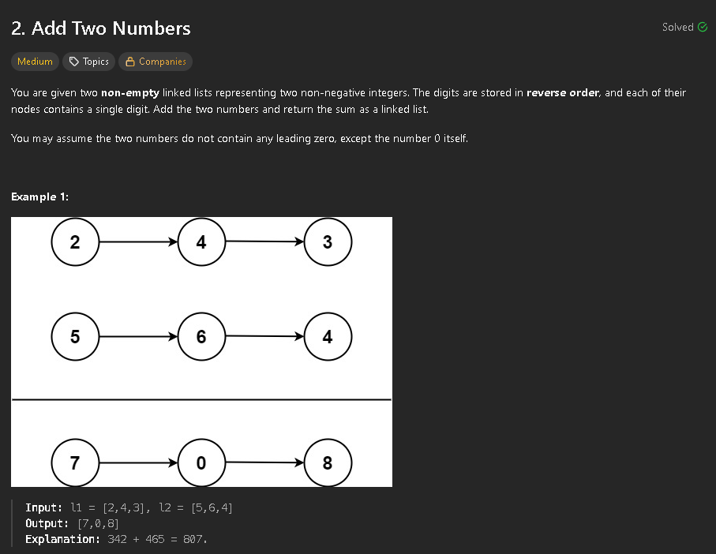

In this problem my approach was iterative and in one while loop.
A dummy node is used for the creation of the linked list.
The loop works until there are no more digits in the lists and there is nothing to carry. Inside of the loop we calculate the sum of list values plus the carry. We then calculate the new carry and move to the next node. 


```cpp
class Solution {
public:
    ListNode* addTwoNumbers(ListNode* l1, ListNode* l2) {
        ListNode* node = new ListNode();
        ListNode* current = node;
        int carry = 0;

        while (l1 != nullptr || l2 != nullptr || carry != 0) {
            int sum = carry;

            if (l1 != nullptr) {
                sum += l1->val;
                l1 = l1->next; 
            }

            if (l2 != nullptr) {
                sum += l2->val;
                l2 = l2->next; 
            }
            
            carry = sum / 10;
            current->next = new ListNode(sum % 10);
            current = current->next;
        }
        
        ListNode* result = node->next;
        delete node;
        return result;
    }
};
```

