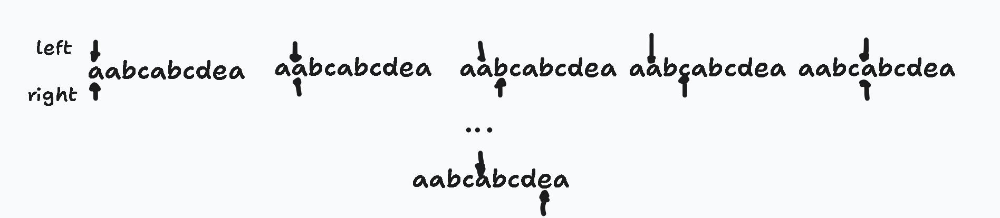

The easiest way to efficiently solve this problem is by using a sliding window. The window's boundaries are defined by a left and right pointer.

The right pointer advances to expand the window. At each step, we check if the new character is a duplicate.
* If the character is not duplicate, it is simply added to the set, and the window continues to expand
* If the character is duplicate, the left pointer advances one position at a time, removing characters from the set until the duplicate is no longer in the window, matching the right pointer

In each iteration, we update the maximum length found so far. This approach avoids re-checking substrings and solves the problem in a single pass.




```cpp
class Solution {
public:
    int lengthOfLongestSubstring(std::string s) {
        if (s.empty()) {
            return 0;
        }
        std::unordered_set<char> charSet;
        int left = 0;
        int maxLength = 0;

        for (int right = 0; right < s.length(); right++) {
            while (charSet.count(s[right])) {
                charSet.erase(s[left]);
                left++;
            }
            charSet.insert(s[right]);
            maxLength = std::max(maxLength, right - left + 1);
        }

        return maxLength;
    }
};
```

