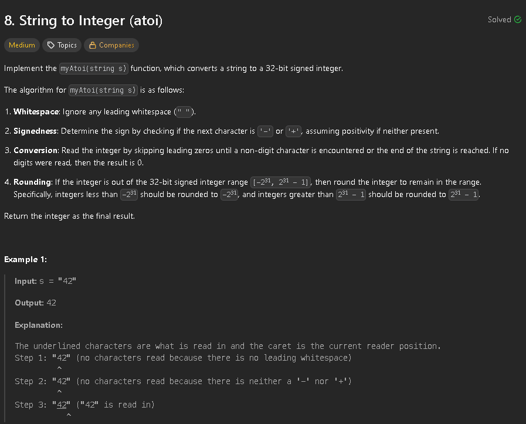
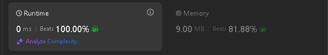

To solve this problem the first thing we need to do is skip all leading whitespaces, then we get the sign. 
We then iteratively go into each digit until we find any non-digit character. In each iteration we are building the result that will be returned, by multiplying the previous result by 10 and adding the new digit. In case of overflow we just return the 32-bit integer, positive or negative.

```cpp
class Solution {
public:
    int myAtoi(string s) {
        bool isNegative = false;
        int index = 0;
        while (index < s.length() && s[index] == ' ') {
            index++;
        }
        if (index < s.length() && s[index] == '-') {
            isNegative = true;
            index++;
        } else if (index < s.length() && s[index] == '+') {
            index++;
        }

        int result = 0;
        while (index < s.length() && s[index] >= '0' && s[index] <= '9') {
            int digit = s[index] - '0';
            
            if (!isNegative && (result > 214748364 || (result == 214748364 && digit > 6))) {
                return 2147483647;
            }
            
            if (isNegative && (result > 214748364 || (result == 214748364 && digit > 7))) {
                return -2147483648;
            }

            result = result * 10 + digit;
            index++;
        }

        return isNegative ? result * -1 : result;
        
    }
};
```
