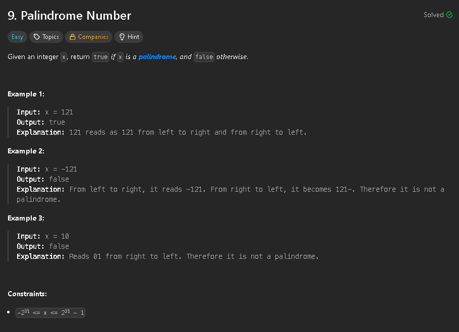

The first thing we do in this problem is returning false when the number is negative.
By following an approach where we don't convert the integer into a string, we create a reversed version of the original number and compare them. 
This brings us to the following results 


```cpp
class Solution {
public:
    bool isPalindrome(int x) {
        if(x < 0) return false;
        long original = x;
        long reverse = 0;
        while(x > 0){
            int last_digit = x % 10;
            reverse = (reverse * 10) + last_digit;
            x /= 10;
        }
        return original == reverse;
    }
};
```