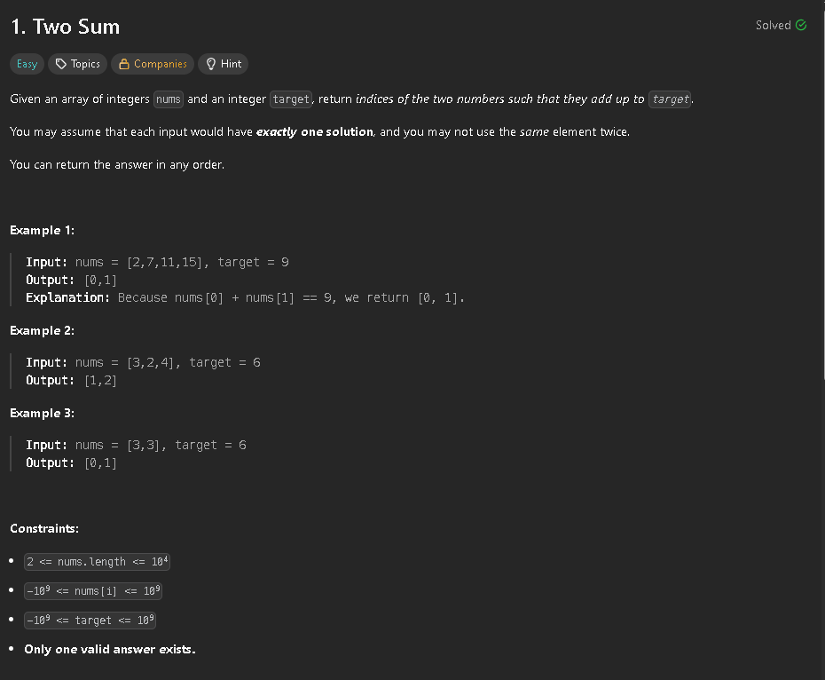

Since this is quite a simple problem, my main focus was to develop the code in the most efficient way possible. 
The first idea that comes to mind is simply using for loops to check if the sum of two numbers in the array is equal to the target: 

```cpp
class Solution {
public:
    vector<int> twoSum(vector<int>& nums, int target) {
        int length = nums.size();
        int length_1 = nums.size() - 1;
        for(int i = 0; i < length_1; i++){ 
            for(int j = i + 1;j < length; j++){ 
                if(nums[i] + nums[j] == target){
                    return {i,j};
                }
            }
        }
        return {};
    }
}; 
```

Seeing as this solution is O(n^2), another approach is needed. That's where the "unordered_map" comes in. This approach allows us to only do one pass through the vector, for each number we calculate the "missing_value" (num - target) and check if that value is inside of the map, if it isn't, we add our nums[i] along with its index to map.

```cpp
class Solution {
public:
    vector<int> twoSum(vector<int>& nums, int target) {
        unordered_map<int, int> map;
        int length = nums.size();
        map.reserve(length);

        int missing_value;
        for(int i = 0; i < length; i++){
            missing_value = target - nums[i];
            if(map.count(missing_value)){
                return {map[missing_value], i};
            }
            map[nums[i]] = i; 

        }
        return {};
    }
};
```

The "map.reserve(length)" allows to get from 4ms to 0ms, increasing the memory usage by about 0.50MB.

Final result: 