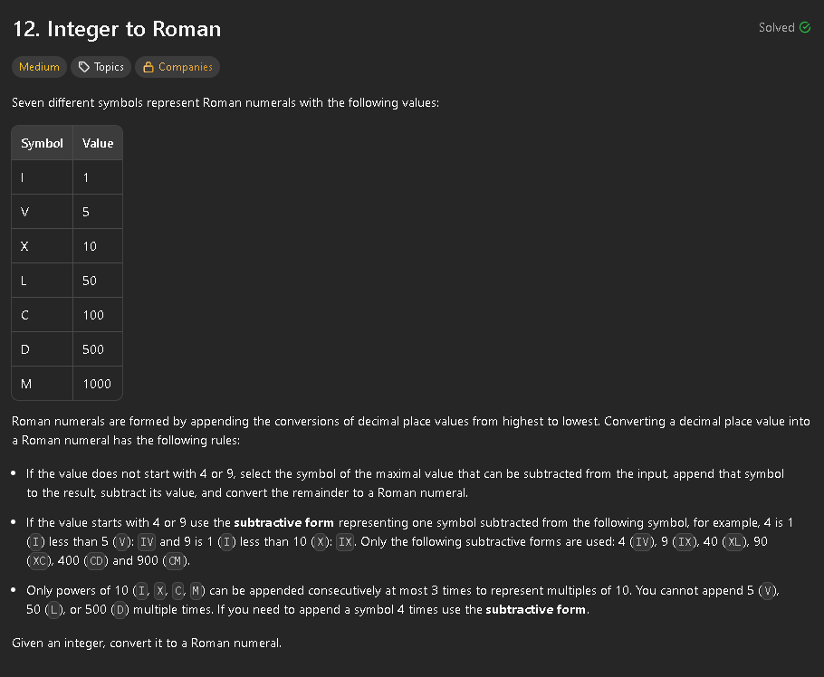

The approach I took to solve this was creating a map with the combinations of symbols and their corresponding value, such as 900 - CM, 40 - XL and so on. 
After that we simply traverse all of the symbols in the map, starting with the biggest. Whenever we find the number that we can subtract to the integer, we do that on a loop (for numbers where the symbol repeats, i.e 2000 - MM). 

```cpp
    std::string intToRoman(int num) {
        std::vector<std::pair<int, std::string>> valToSym = {
            {1000, "M"},
            {900, "CM"},
            {500, "D"},
            {400, "CD"},
            {100, "C"},
            {90, "XC"},
            {50, "L"},
            {40, "XL"},
            {10, "X"},
            {9, "IX"},
            {5, "V"},
            {4, "IV"},
            {1, "I"}
        };
        
        std::string result = "";
        for (const auto& p : valToSym) {
            int value = p.first;
            std::string symbol = p.second;
            while (num >= value) {
                result += symbol;
                num -= value;
            }
        }
        
        return result;
    }
```

```js
    intToRoman(num) {
        const valToSym = new Map([
            [1000, "M"],
            [900, "CM"],
            [500, "D"],
            [400, "CD"],
            [100, "C"],
            [90, "XC"],
            [50, "L"],
            [40, "XL"],
            [10, "X"],
            [9, "IX"],
            [5, "V"],
            [4, "IV"],
            [1, "I"]
        ]);
        
        let result = "";
        for (let [value, symbol] of valToSym) {
            while (num >= value) {
                result += symbol;
                num -= value;
            }
        }
        
        return result;
    }
```