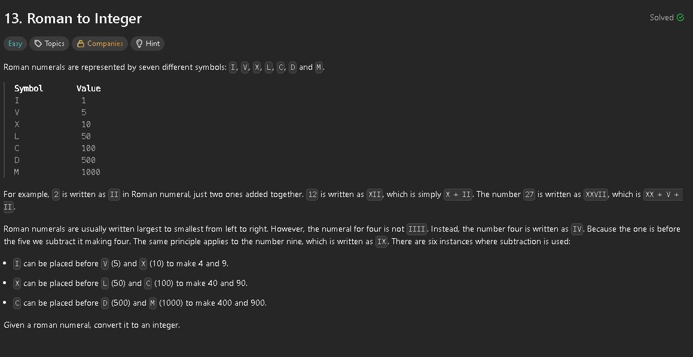
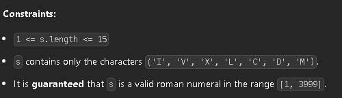

Considering the constraints of the problem state that every Roman number is valid, we can just create a map with the basic symbols and no combinations. After that we create a "result" variable and iterate the Roman number from right to left. As we move left, if the current symbol's value is less than the previous one, we know we've hit a pair like 'IV' or 'IX',  so we subtract the current value from the total. Otherwise, if the current value is greater than or equal to the previous value, we simply add it

```cpp
class Solution {
public:
    int romanToInt(std::string s) {
        std::unordered_map<char, int> roman_map = {
            {'I', 1},
            {'V', 5},
            {'X', 10},
            {'L', 50},
            {'C', 100},
            {'D', 500},
            {'M', 1000}
        };

        int result = 0;
        int prev_value = 0;

        for (int i = s.length() - 1; i >= 0; --i) {
            int current_value = roman_map.at(s[i]); 

            if (current_value < prev_value) {
                result -= current_value;
            } else {
                result += current_value;
            }
            
            prev_value = current_value;
        }

        return result;
    }
};
```
