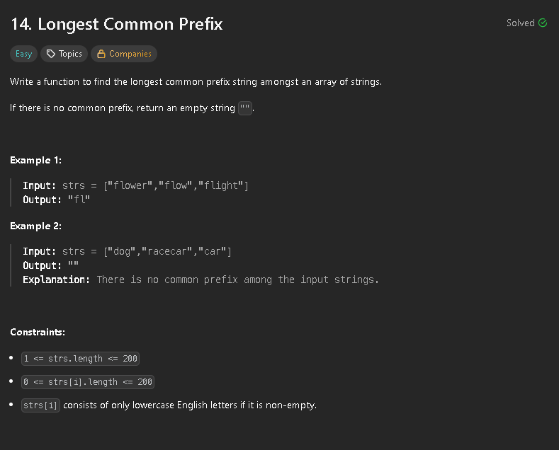

My first approach to solve this problem was using two for loops, one for the character indexes and the other for actually checkignall strings in the array. In the outer loop we just choose the char to use and then in the inner loop we check if we reached the end of the string (if a string ends that means that there can't be a longer prefix) or if the character in one of the strings isn't the character we're comparing against. 


```cs
public class Solution {
    public string LongestCommonPrefix(string[] strs) {
        if (strs == null || strs.Length == 0) {
            return "";
        }

        string result = "";

        for (int i = 0; i < strs[0].Length; i++) {
            char charToCompare = strs[0][i];
            for (int j = 1; j < strs.Length; j++) {
                
                if (i >= strs[j].Length || strs[j][i] != charToCompare) {
                    return result;
                }
            }
            result += charToCompare;
        }

        return result;
    }
}
```