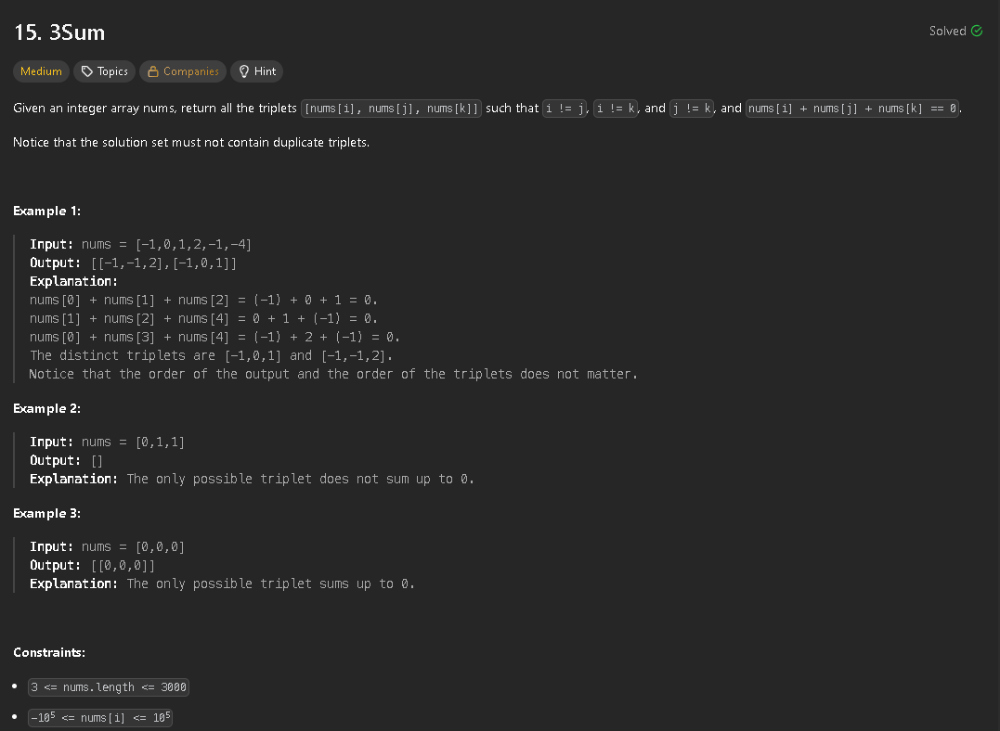

The first approach I choose to do was simply using 3 for loops, but that is clearly problematic since we're getting into a complexity of O(n^3), in which the solution would fail in leetcode due to time limits.
To solve this correctly we can start by sorting the array and then we can turn this problem into a 2 sum. We have a for loop for the value of i and then nums[j] + nums[k] = -nums[i]. 
Since the array is sorted we can solve this 2 sum by starting j and k at both ends of the (sub)array (we start j from i + 1). 
We can further optimize this by skipping the values of j and/or k whenever there are duplicate values in the array by adding a condition 'nums[j] == nums[j+1]' to the while


```js
/**
 * @param {number[]} nums
 * @return {number[][]}
 */
var threeSum = function(nums) {
    nums.sort((a,b)=> a - b);
    const results = [];

    for(let i = 0; i < nums.length - 2; i++){
        if (i === 0 || nums[i] !== nums[i-1]) {
            let j = i + 1;
            let k = nums.length - 1;
            while(j < k){
                if (nums[j] + nums[k] === -nums[i]) {
                    results.push([nums[i], nums[j], nums[k]]);

                    // remove duplicates
                    while (j < k && nums[j] === nums[j + 1]) {
                        j++;
                    }
                    
                    while (j < k && nums[k] === nums[k - 1]) {
                        k--;
                    }

                    // we change the value of both j and k since if there are no more duplicates
                    j++;
                    k--;               
                } else if (nums[j] + nums[k] < -nums[i]) {
                    // value too small, increment j
                    j++;
                    
                } else {
                    // value too big, decrement k
                    k--;
                }
            }

        }
    }
    return results;
};
```