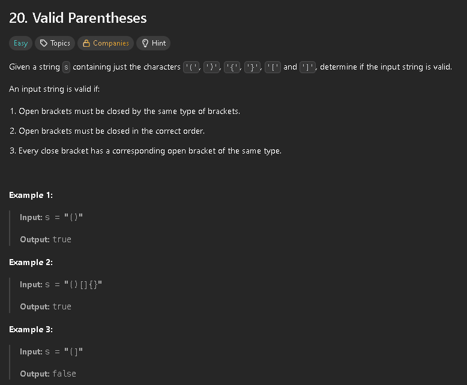
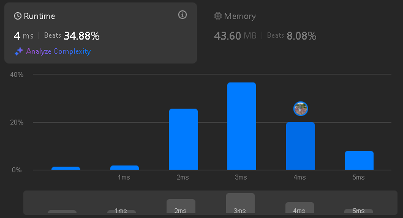

This problem presents a typical Last-in First-Out problem, so my immediate thought was to use a stack along with a map to match the open and close brackets. 



This could be further optimized by not using a map and hardcoding values, as well as using a manual stack (array) implementation instead of the Stack class.

```java
class Solution {
    public boolean isValid(String s) {
        Map<Character, Character> map = new HashMap<>();
        map.put('(', ')');
        map.put('[', ']');
        map.put('{', '}');
        Stack<Character> stack = new Stack<>();
        for(char c : s.toCharArray()){
            if(map.containsKey(c)){
                stack.push(c);
            }
            else{
                if(stack.isEmpty()) {
                    return false;
                }
                char p = stack.peek();
                if(c == map.get(p)){
                    stack.pop();
                }
                else{
                    return false;
                }
            }
            
        }
        if(!stack.isEmpty()){
            return false;
        }
        return true;

    }
}
```