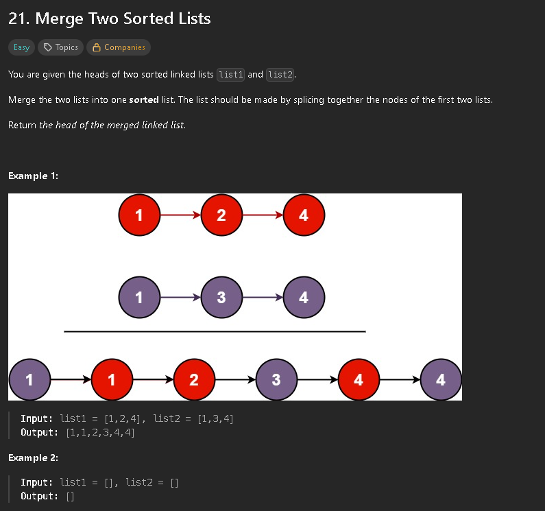

My immediate thought to solve this problem was to just merge both lists and then sort them. This would be a O(nlogn) solution, which is not optimal.
The next idea I had was to do everything in one loop, where I compare both heads of the linked lists and add the smaller one to the result, and then move the head of that list. In the next iteration we compare the heads of the lists and so on.


This could be further optimized by not using a map and hardcoding values, as well as using a manual stack (array) implementation instead of the Stack class.

```java
class Solution {
    public ListNode mergeTwoLists(ListNode list1, ListNode list2) {
        if (list1 == null) return list2;
        if (list2 == null) return list1;

        ListNode head;
        ListNode current;

        if (list1.val <= list2.val) {
            head = list1;
            list1 = list1.next;
        } else {
            head = list2;
            list2 = list2.next;
        }
        
        current = head;

        while (list1 != null && list2 != null) {
            if (list1.val <= list2.val) {
                current.next = list1;
                list1 = list1.next;
            } else {
                current.next = list2;
                list2 = list2.next;
            }
            current = current.next;
        }

        if (list1 != null) {
            current.next = list1;
        } else if (list2 != null) {
            current.next = list2;
        }

        return head;
    }
}
```