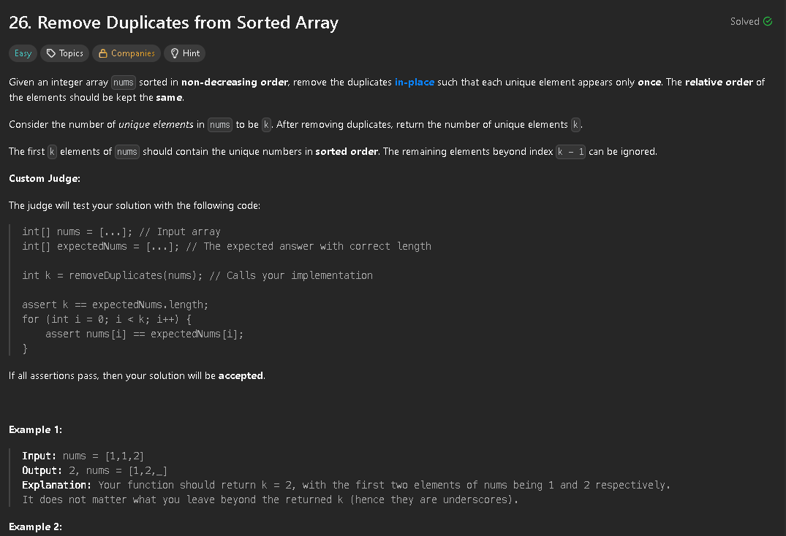

My immediate thought to solve this problem was to have two loops iterating and create a new array, removing all duplicates along the way. However, this would violate the requirement of the algorithm being in-place.
The next idea I had was to do everything in one loop, where I have two different "pointers", i and j, doing different jobs. We can consider i the 'writer' and j the 'iterator'. for every iteration we compare the values of nums[i] and nums[j]. If they're the same we go to the next iteration. Otherwise we increment i and give nums[i] the value nums[j]


This could be further optimized by not using a map and hardcoding values, as well as using a manual stack (array) implementation instead of the Stack class.

```java
class Solution {
    public int removeDuplicates(int[] nums) {
        int len = nums.length;
        int i = 0;
        for(int j = 1; j < len; j++){
            if(nums[i] != nums[j]){
                i++;
                nums[i] = nums[j];
            }
        }
        return i + 1;
    }
}
```