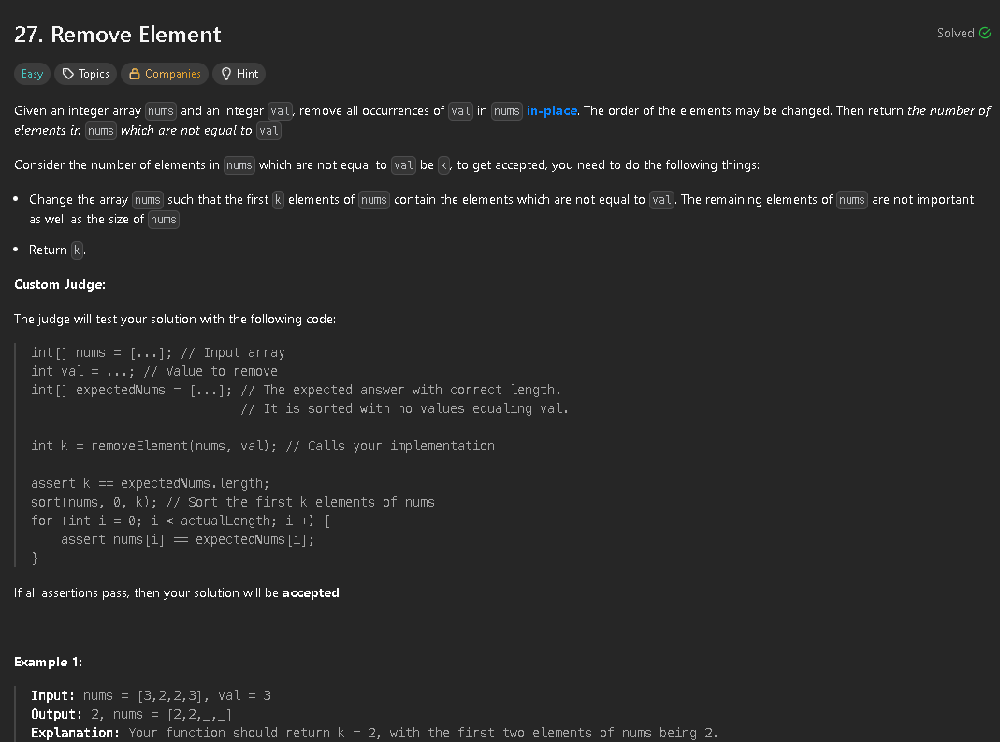

i did this problem after solving 26, so it became quite an easy problem to solve by following the same approach as the last. Instead of having the "Iterator" starting with 1 and the 'Writer' with 0, we start both values in 0 and check if the value is the target, skipping if so. Otherwise we check if i and j are different and update the value in i. We increment i even if they are the same number, but since nums[i] and nums[j] would be the same number we can skip that allocation


```java
class Solution {
    public int removeElement(int[] nums, int val) {
        int len = nums.length;
        int i = 0;
        for(int j = 0; j < len; j++){
            if(nums[j] == val){
                continue;
            }
            if(i != j){
                nums[i] = nums[j];
            }
            i++;
        }
        return i;
    }
}
```