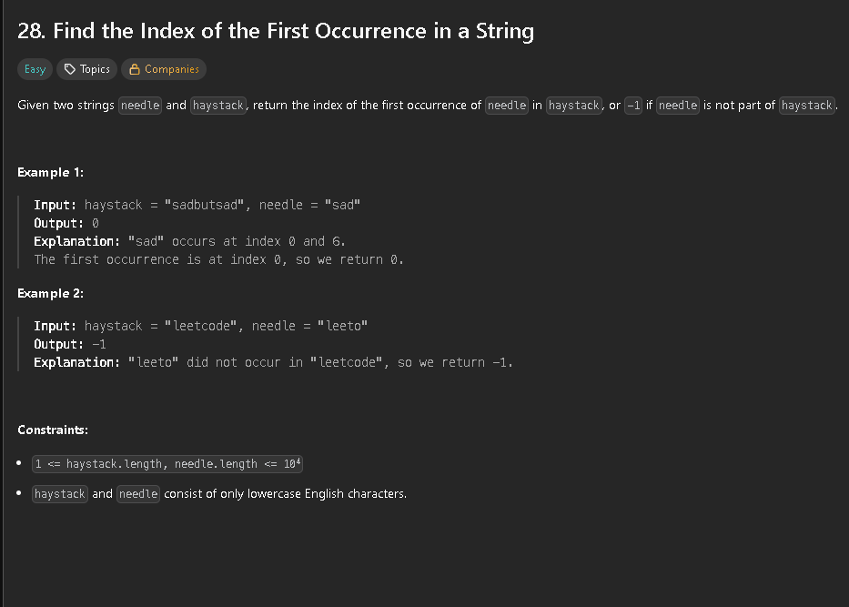

To solve this problem we can use i and j to compare the values of the two strings. If the characters that correspond to the positions of i and j are the same we increment both i and j. Otherwise we reset j to 0 (start of needle) and move i back to the start + 1 of the failed match


```java
class Solution {
    public int removeElement(int[] nums, int val) {
        int len = nums.length;
        int i = 0;
        for(int j = 0; j < len; j++){
            if(nums[j] == val){
                continue;
            }
            if(i != j){
                nums[i] = nums[j];
            }
            i++;
        }
        return i;
    }
}
```